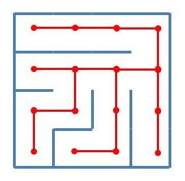
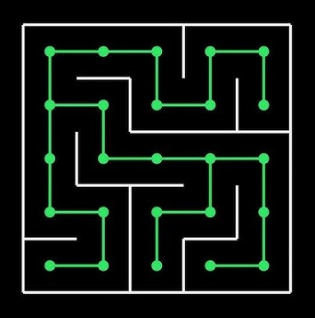

# _Gaming "Hello, World!"_

Esse repositório contém o meu _"Hello, World!"_ do desenvolvimento de jogos,
sendo um jogo com o propósito de aprender os conceitos de _game dev_ e de
_pixel art_ para criação de _sprites_. Decidi por utilizar as seguintes 
ferramentas: **_Java_** para lidar com toda a lógica, **_LibreSprite_** para criação
de _sprites_, e **_IntelliJ_** para servir de ambiente de desenvolvimento e gerenciamento de pacotes.

### Execução

Pré requisitos: **JDK 21** ou superior. Este projeto foi compilado utilizando o JDK 21, sendo este necessário
para a sua execução.
- Fazer o download do JAR mais atual na seção de **_releases_**.
- Executar o arquivo no terminal:
  ```
  java -jar caminho\para\o\arquivo\Gaming_HelloWorld.jar
  ```

## **_Purranormal Maze_**

**_Purranormal Maze_** é um jogo de exploração de labirintos feitos através
de geração procedural de maneira aleatória, derrotando inimigos e coletando
objetos distribuídos no mapa. 

A protagonista do jogo é a gata Meg, uma felina que consegue invocar
espíritos elementais de fogo, gelo e eletricidade, que gosta de
colecionar itens para levar para o seu dono.

O objetivo do jogo é encontrar todos os baús no menor tempo possível, 
derrotando o máximo de inimigos e coletando o máximo de itens.

### Controles
**W, A, S, D** - Movimentação

**P** - Pause

**M** - Miar

**J** - Arranhar

**K** - Magia de fogo

**U** - Magia de gelo

**I** - Magia de eletricidade

### Personagens e inimigos

|                   |  |  |  |
|----------------------------------------------------------|-------------------------------------------|-------------------------------------------|---------------------------------------------|
| <div align=center>Meg</div>                              | <div align=center>Slime</div>             | <div align=center>Mimic</div>             | <div align=center>Fire Summon</div>         |
| Personagem principal. Pode<br/> invocar seres elementais | Uma meleca                                | Um baú falso                              | Invocação de fogo da Meg                    |


## Algoritmo de geração de labirintos

| **_Binary Tree_**                                                                                                                                                                                                                                                                                                                                                                                 | **_Hunt and Kill_**                                                                                                                                                                                                                                                                                                                                                                                                                                                   |
|---------------------------------------------------------------------------------------------------------------------------------------------------------------------------------------------------------------------------------------------------------------------------------------------------------------------------------------------------------------------------------------------------|-----------------------------------------------------------------------------------------------------------------------------------------------------------------------------------------------------------------------------------------------------------------------------------------------------------------------------------------------------------------------------------------------------------------------------------------------------------------------|
| Esse algoritmo consiste em percorrer uma matriz (Labirinto), e, para cada elemento (Célula / Casa), o algoritmo abre um caminho aleatoriamente com o vizinho "norte" ou "oeste", com o layout final se assemelhando a uma árvore binária, onde cada nó só tem dois filhos. O labirinto gerado por esse labirinto tem a limitação de ser um pouco previsível e ter dois lados completamente vazios | Este algoritmo consiste em visitar um elemento aleatório da matriz, e em seguida abrir um caminho com uma célula vizinha que não foi visitada ainda. Caso o algoritmo chegue em um ponto onde não há mais células que não foram visitadas ao redor, o algoritmo entra no modo _Hunt_, onde ele busca uma célula não visitada que possui pelo menos um vizinho que já foi visitado, abre caminho entre eles e volta ao modo Kill, até todas as células serem visitadas |
| <div align=center>  </div>                                                                                                                                                                                                                                                                                  | <div align=center>  </div>                                                                                                                                                                                                                                                                                                                                      |
