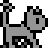

# _Gaming "Hello, World!"_

Esse repositório contém o meu _"Hello, World!"_ do desenvolvimento de jogos,
sendo um jogo com o propósito de aprender os conceitos de _game dev_ e de
_pixel art_ para criação de _sprites_. Decidi por utilizar as seguintes ferramentas: 
**_Java_** para lidar com toda a lógica, **_LibreSprite_** para criação de _sprites_, 
e **_IntelliJ_** para servir de ambiente de desenvolvimento e gerenciamento de pacotes.
---
This repository contains my "Hello, World!" in game development, a game created
to learn the fundamentals of **game dev** and **pixel art** for sprite creation. I have
decided to use the following tools for this project: **Java** for handling all the
logic, **LibreSprite** for sprite creation, **IntelliJ** as the development environment
and package manager.

### Execução | Running the Game

Pré requisitos: **JDK 21** ou superior. Este projeto foi compilado utilizando o 
JDK 21, sendo este necessário para a sua execução.
- Fazer o download do JAR mais atual na seção de **_releases_**.
- Executar o arquivo no terminal:
  ```
  java -jar caminho\para\o\arquivo\Gaming_HelloWorld.jar
  ```
---
Requirements: **JDK 21** or later. This project was compiled using JDK 21, which is
required to run it.
- Download the latest JAR file from the **releases** section.
- Run the file on the command line:
  ```
  java -jar path\to\file\Gaming_HelloWorld.jar
  ```

## **_Purranormal Maze_**

**_Purranormal Maze_** é um jogo de exploração de labirintos feitos através
de geração procedural de maneira aleatória, derrotando inimigos e coletando
objetos distribuídos no mapa. 

A protagonista do jogo é a gata Meg, uma felina que consegue invocar
espíritos elementais de fogo, gelo e eletricidade, que gosta de
colecionar itens para levar para o seu dono.

O objetivo do jogo é encontrar todos os baús garantindo a melhor pontuação, 
derrotando o máximo de inimigos e coletando o máximo de itens.
---
Purranormal Maze is a maze-exploration game featuring procedurally
generated maps, where players defeat enemies and collect items scattered
across the map.

This game's protagonist is Meg, a cat capable of summoning elemental
spirits of fire, ice and electricity. She also enjoys collecting items
to bring back to her master.

The goal is to find all the treasure chests and score as high as you can,
defeating enemies and gathering many items.

### Controles | Controls
**W, A, S, D** - Movimentação - Walking

**P** - Pausar - Pause

**M** - Miar - Meow

**J** - Arranhar - Scratch

**K** - Magia de fogo - Fire summon

**U** - Magia de gelo - Ice summon

**I** - Magia de eletricidade - Electric summon

### Personagens e inimigos

|                                |  |  |                     |
|-----------------------------------------------------------------------|-------------------------------------------|-------------------------------------------|----------------------------------------------------------------|
| <div align=center>Meg</div>                                           | <div align=center>Slime</div>             | <div align=center>Mimic</div>             | <div align=center>Fire Summon</div>                            |
| Protagonista, invoca elementais <br/> Protagonist, summons elementals | Uma meleca<br/>Just a blob                | Um baú falso <br/> A fake treasure        | Invocação de fogo da Meg <br/> Fire elemental summon character |


## Algoritmo de geração de labirintos

| **_Binary Tree_**                                                                                                                                                                                                                                                                                                                                                                                 | **_Hunt and Kill_**                                                                                                                                                                                                                                                                                                                                                                                                                                                   |
|---------------------------------------------------------------------------------------------------------------------------------------------------------------------------------------------------------------------------------------------------------------------------------------------------------------------------------------------------------------------------------------------------|-----------------------------------------------------------------------------------------------------------------------------------------------------------------------------------------------------------------------------------------------------------------------------------------------------------------------------------------------------------------------------------------------------------------------------------------------------------------------|
| Esse algoritmo consiste em percorrer uma matriz (Labirinto), e, para cada elemento (Célula / Casa), o algoritmo abre um caminho aleatoriamente com o vizinho "norte" ou "oeste", com o layout final se assemelhando a uma árvore binária, onde cada nó só tem dois filhos. O labirinto gerado por esse labirinto tem a limitação de ser um pouco previsível e ter dois lados completamente vazios | Este algoritmo consiste em visitar um elemento aleatório da matriz, e em seguida abrir um caminho com uma célula vizinha que não foi visitada ainda. Caso o algoritmo chegue em um ponto onde não há mais células que não foram visitadas ao redor, o algoritmo entra no modo _Hunt_, onde ele busca uma célula não visitada que possui pelo menos um vizinho que já foi visitado, abre caminho entre eles e volta ao modo Kill, até todas as células serem visitadas |
| <div align=center>  </div>                                                                                                                                                                                                                                                                                  | <div align=center>  </div>                                                                                                                                                                                                                                                                                                                                      |
| This algorithm traverses a matrix (maze), and for each element (cell/tile), it randomly opens a path to either the "north" or "west" neighbor. The final layout resembles a binary tree, where each node has at most two children. A limitation of this algorithm is that the resulting maze can be somewhat predictable, with two completely empty sides.                                        | This algorithm starts by visiting a random cell in the matrix and carving a path to an unvisited neighbor. If it reaches a dead end (a cell with no unvisited neighbors), it switches to Hunt Mode, searching for an unvisited cell that has at least one visited neighbor. It then connects them, returning to Kill Mode, and continues until all cells are visited.                                                                                                 |
